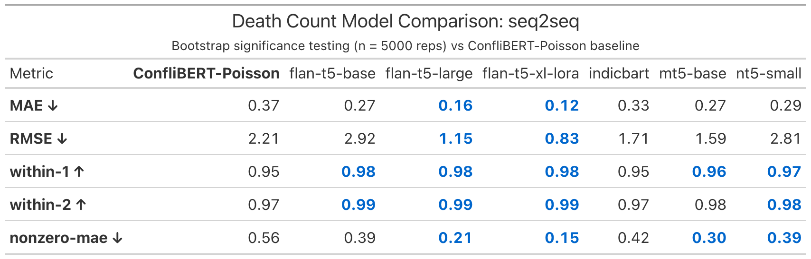
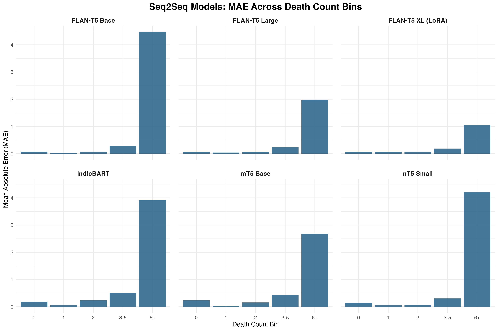

## Overview

- SATP Maoist insurgency event summaries (hand-coded benchmark data)
- Broader project evaluates extraction and coding tasks with transformer models
- T5-family models were tested across two extraction tasks:
  - death counts
  - event location names
- Today: walkthrough of the **death-count extraction** pipeline and code

## Data: South Asia Terrorism Portal (SATP)

- Focus: Maoist insurgency in India
- ~10,000 hand-coded event summaries


## Why Death Counts Are Hard

- Multiple numbers often appear in one summary
- Need to distinguish fatalities from injuries/arrests/seizures
- High-fatality events are rare but substantively important
- Aggregate metrics can hide weak tail performance

## Death Counts: Models

- **seq2seq**
  - *T5 family--*Flan-T5 (base, large, XL LoRA)
  - *Specialized--*mT5 base, nT5 small, IndicBART
  - *Across project scope:* T5-family models were also tested for event location extraction
- **LLMs (comparison context)--**
  - Open source + proprietary decoder models
- **Baseline--** ConfliBERT with a Poisson head

## Death Counts: Train-Test Split

- Filter for violent events
- 60/20/20 split
- Weighted by death-count bins (`0`, `1`, `2`, `3-5`, `6+`)

## Death Counts: Performance Metrics

- Mean absolute error (MAE)
- Root mean squared error (RMSE)
- Within 1 of actual count
- Within 2 of actual count
- Nonzero MAE
- Bin-level metrics (especially `3-5`, `6+`)

## Main Seq2Seq Results

<br>

{fig-align="center"}

## Code Walkthrough Roadmap {.smaller}

1. `models/count-models/death-count-extraction-seq2seq.ipynb`
2. `models/count-models/utils/data_utils.py`
   - `prepare_seq2seq_data(...)`
   - `tokenize_seq2seq(...)`
3. `models/count-models/utils/training_utils.py`
4. `models/count-models/utils/extraction_utils.py`
   - `extract_number(...)`
   - `parse_prediction(...)`
5. `models/count-models/utils/metrics_utils.py`
   - `compute_metrics(...)`

## Parser Reliability

- Beyond just a modeling challenge, event count extraction is also a **measurement pipeline** problem:
  - model output format
  - parser behavior
  - metric computation
- If parsing fails or defaults to `0`, errors can be misattributed to the model

## Parser Reliability

Excerpt from `models/count-models/utils/extraction_utils.py`:

```python
def parse_prediction(raw_output, model_type='seq2seq'):
    if model_type == 'regression':
        try:
            return max(0, round(float(raw_output)))
        except:
            return 0
    else:
        num = extract_number(raw_output)
        return num if num is not None else 0
```

- Practical issue: parser failure and true zero predictions are both returned as `0`

## Parser Reliability

- Track parser diagnostics per prediction:
  - `parse_success`
  - `parse_method`
  - `defaulted_to_zero_due_to_parse_failure`
- Report parser reliability alongside MAE/RMSE
- Harmonize parsing logic across seq2seq and LLM paths where possible
- Expand number-word handling and ambiguity tracking

## Rare-Bin Performance Problem 

- Aggregate performance can look strong while tail bins remain weak
- This matters for conflict research because high-fatality events are often the most analytically important
- We should evaluate improvements specifically on `3-5` and `6+` bins

## Seq2Seq MAE Across Death Count Bins

{fig-align="center"}

## Improving Rare-Bin Performance {.smaller}

- **Seq2seq training-side (priority)**
  - weighted sampling / oversampling by rare bins
  - per-example loss weighting by bin
  - rare-bin augmentation (back-translation / paraphrase) with strict count-preservation checks
- **Prompting-side (comparison / extension)**
  - targeted few-shot prompts with high-count examples
  - bin-balanced few-shot prompt sets
- **Measurement-side**
  - parser diagnostics so gains/losses in rare bins are not artifacts of parsing

## Comments?

:::{.columns}

::: {.column width="50%"}
Thank you! 🙏

<br>
<br>

Questions / feedback welcome
:::

::: {.column width="50%"}
  
:::
:::
